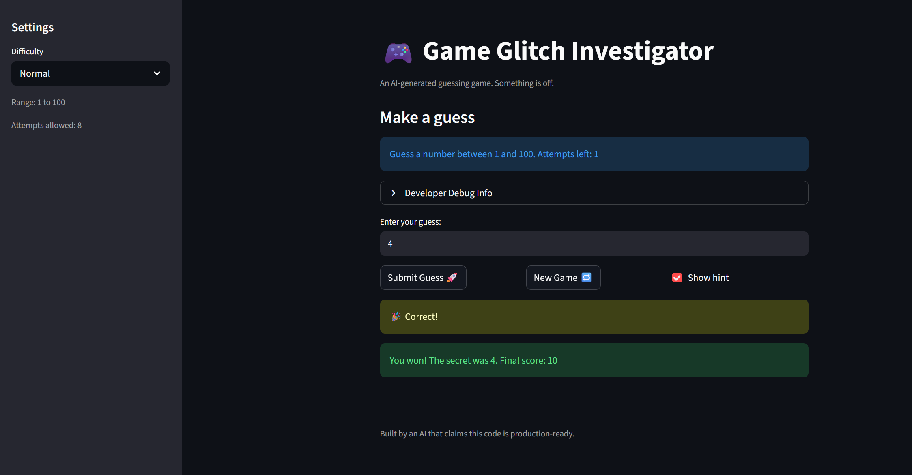
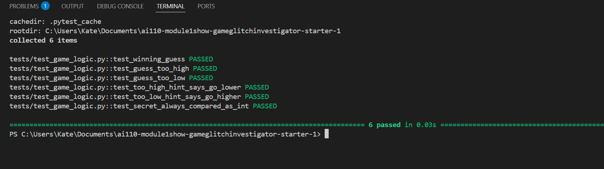

# 🎮 Game Glitch Investigator: The Impossible Guesser

## 🚨 The Situation

You asked an AI to build a simple "Number Guessing Game" using Streamlit.
It wrote the code, ran away, and now the game is unplayable. 

- You can't win.
- The hints lie to you.
- The secret number seems to have commitment issues.

## 🛠️ Setup

1. Install dependencies: `pip install -r requirements.txt`
2. Run the broken app: `python -m streamlit run app.py`

## 🕵️‍♂️ Your Mission

1. **Play the game.** Open the "Developer Debug Info" tab in the app to see the secret number. Try to win.
2. **Find the State Bug.** Why does the secret number change every time you click "Submit"? Ask ChatGPT: *"How do I keep a variable from resetting in Streamlit when I click a button?"*
3. **Fix the Logic.** The hints ("Higher/Lower") are wrong. Fix them.
4. **Refactor & Test.** - Move the logic into `logic_utils.py`.
   - Run `pytest` in your terminal.
   - Keep fixing until all tests pass!

## 📝 Document Your Experience

**Game purpose:** A number guessing game where the player tries to guess a secret number within a limited number of attempts. The game gives directional hints after each guess and tracks a score.

**Bugs found:**
- The hint messages were inverted "Too High" told the player to go higher, and "Too Low" told them to go lower, the opposite of what they should do.
- On every even-numbered attempt, the secret was converted to a string before comparison, causing alphabetical ordering instead of numeric (e.g. `"9" > "47"` = true alphabetically but false numerically).
- Starting a new game did not reset `session_state.status`, so the win/loss screen persisted and blocked the new game.

**Fixes applied:**
- Swapped the hint messages in `check_guess` so each direction points correctly.
- Removed the even/odd string conversion in `app.py` so the secret is always compared as an integer.
- Refactored `check_guess`, `parse_guess`, `update_score`, and `get_range_for_difficulty` into `logic_utils.py` to separate game logic from UI code.
- Added 6 pytest tests in `tests/test_game_logic.py` to verify the fixes, including regression tests targeting each specific bug.

## 📸 Demo

## 🚀 Stretch Features

- [ ] [If you choose to complete Challenge 4, insert a screenshot of your Enhanced Game UI here]
